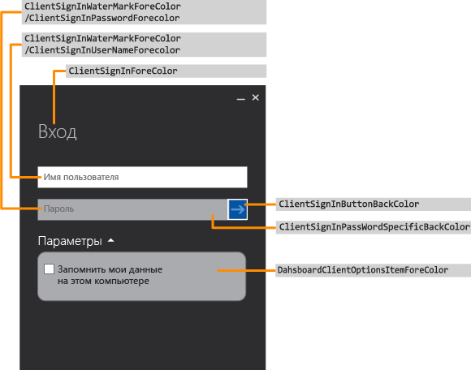

# <a name="change-the-color-scheme-of-the-dashboard-and-launchpad"></a>Изменение цветовой схемы панели мониторинга и панели запуска

>Область применения: Windows Server 2016 Essentials, Windows Server 2012 R2 Essentials, Windows Server 2012 Essentials

Можно изменить цветовую схему панели мониторинга и панели запуска, путем определения цвета, которые вы хотите использовать в XML-файле, установить XML-файл в папку на сервере и указать имя XML-файла в записи реестра.  
  
## <a name="create-the-xml-file"></a>Создайте XML-файл  
 В следующем примере показано возможное содержимое XML-файла:  
  
```xml  
<DashboardTheme xmlns="https://www.microsoft.com/HSBS/Dashboard/Branding/2010">  
  
  <!-- Hex color values overwriting default SKU theme colors -->  
  
    <SplashScreenBackgroundColor HexValue="FFFFFFFF"/>  
    <SplashScreenBorderColor HexValue="FF000000"/>  
    <MainHeaderBackgroundColor HexValue="FF414141"/>  
    <MainTabBackgroundColor HexValue="FFFFFFFF"/>  
    <MainTabFontColor HexValue="FF999999"/>  
    <MainTabHoverFontColor HexValue="FF0072BC"/>  
    <MainTabSelectedFontColor HexValue="FF0072BC"/>  
    <MainButtonPressedBackgroundColor HexValue="FF0072BC"/>  
    <MainButtonFontColor HexValue="FFFFFFFF"/>  
    <MainButtonBorderColor HexValue="FF6E6E6E"/>  
    <ScrollButtonBackgroundColor HexValue="FFF0F0F0"/>  
    <ScrollButtonArrowColor HexValue="FF999999"/>  
    <ScrollButtonHoverBackgroundColor HexValue="FF999999"/>  
    <ScrollButtonHoverArrowColor HexValue="FF6E6E6E"/>  
    <ScrollButtonSelectedBackgroundColor HexValue="FF6E6E6E"/>  
    <ScrollButtonSelectedArrowColor HexValue="FFFFFFFF"/>  
    <ScrollButtonDisabledBackgroundColor HexValue="FFF8F8F8"/>  
    <ScrollButtonDisabledArrowColor HexValue="FFCCCCCC"/>  
    <AlertTextBlockBackground HexValue="FFFFFFFF"/>  
    <AlertTextBlockFont HexValue="FF000000"/>  
    <FontColor HexValue="FF000000"/>  
    <SubTabBarBackgroundColor HexValue="FFFFFFFF"/>  
    <SubTabBackgroundColor HexValue="FFFFFFFF"/>  
    <SubTabSelectedBackgroundColor HexValue="FF414141"/>  
    <SubTabBorderColor HexValue="FF787878"/>  
    <SubTabFontColor HexValue="FF787878"/>  
    <SubTabHoverFontColor HexValue="FF0072BC"/>  
    <SubTabPressedFontColor HexValue="FFFFFFFF"/>  
    <ListViewColor HexValue="FFFFFFFF"/>  
    <PageBorderColor HexValue="FF999999"/>      
    <LaunchpadButtonHoverBorderColor HexValue="FF6BA0B4"/>  
    <LaunchpadButtonHoverBackgroundColor HexValue="FF41788F"/>  
    <ClientArrowColor HexValue="FFFFFFFF"/>  
    <ClientGlyphColor HexValue="FFFFFFFF"/>  
    <SplitterColor HexValue="FF83C6E2"/>  
    <HomePageBackColor     HexValue="FFFFFFFF"/>  
    <CategoryNotExpandedBackColor HexValue="FFFFB343"/>  
    <CategoryExpandedBackColor HexValue="FFF26522"/>  
    <CategoryNotExpandedForeColor HexValue="FF2A2A2A"/>  
    <CategoryExpandedForeColor HexValue="FFFFFFFF"/>  
    <HomePageTaskListForeColor    HexValue="FF2A2A2A"/>  
    <HomePageTaskListBackColor HexValue="FFEAEAEA"/>  
    <HomePageTaskListHoverForeColor      HexValue="FF2A2A2A"/>  
    <HomePageTaskListItemBorderColor     HexValue="FF999999"/>  
    <HomePageTaskListSelectedForeColor   HexValue="FFFFFFFF"/>  
    <HomePageTaskListSelectedBackColor   HexValue="FFF26522"/>  
    <HomePageTaskDetailStatusForeColor   HexValue="FFF26522"/>  
    <HomePageTaskDetailDescriptionForeColor     HexValue="FF2A2A2A"/>  
    <HomePageLinkForeColor HexValue="FF0072BC"/>  
    <HomePageLinkSelectedForeColor HexValue="FF0054A6"/>  
    <HomePageLinkHoverForeColor   HexValue="FF0072BC"/>  
    <PropertyFormForeColor HexValue="FF2A2A2A"/>  
    <PropertyFormTabHoverColor HexValue="FF0072BC"/>  
    <PropertyFormTabSelectedColor HexValue="FFFFFFFF"/>  
    <PropertyFormTabSelectedBackColor HexValue="FF414141"/>  
    <TaskPanelBackColor HexValue="FFFFFFFF"/>  
    <TaskPanelItemForeColor HexValue="FF2A2A2A"/>  
    <TaskPanelGroupTitleForeColor HexValue="FF2A2A2A"/>  
    <TaskPanelGroupTitleBackColor HexValue="FFCCCCCC"/>  
    <DashboardClientBackColor HexValue="FF004050"/>  
    <DashboardClientTitleColor HexValue="FFFFFFFF"/>  
    <DashboardClientOptionsForeColor HexValue="FFFFFFFF"/>  
    <DashboardClientOptionsItemForeColor HexValue="FF2A2A2A"/>  
    <DashboardClientHelpForeColor HexValue="FF0054A6"/>  
    <ClientSignInForeColor HexValue="FFFFFFFF"/>  
    <ClientSignInWaterMarkForeColor HexValue="FF999999"/>  
    <ClientSignInUserNameForeColor HexValue="FF2A2A2A"/>  
    <ClientSignInPassWordSpecificBackColor HexValue="FFCCCCCC"/>  
    <ClientSignInButtonBackColor HexValue="FF004050"/>  
    <ClientSignInPassWordForeColor HexValue="FF2A2A2A"/>  
    <LaunchPadBackColor HexValue="FF004050"/>  
    <LaunchPadPageTitleColor HexValue="FFFFFFFF"/>  
    <LaunchPadItemForeColor HexValue="FFFFFFFF"/>  
  <LaunchPadItemHoverColor HexValue="33FFFFFF"/>  
  <LaunchPadItemIconBackgroundColor HexValue="F2004050"/>  
</DashboardTheme >  
  
```  
  
> [!IMPORTANT]
>  XML-элементы необходимо указать в порядке, указанном в предыдущем примере.  
  
> [!NOTE]
>  Все значения атрибутов HexValue являются примерами шестнадцатеричные значения цветов. Можно ввести любой шестнадцатеричное значение цвета, вы хотите использовать.  
  
 Используйте Блокнот или Visual Studio 2010 для создания XML-файл, содержащий теги для областей, которые требуется настроить. Файл можно предоставить любое имя, но он должен иметь расширение XML. Описание областей, которые можно настраивать на панели мониторинга и панель запуска см. в разделе [мониторинга и запуска областей, которые могут быть изменены](Change-the-Color-Scheme-of-the-Dashboard-and-Launchpad.md#BKMK_Dashboard).  
  
#### <a name="to-install-the-xml-file"></a>Установка XML-файл  
  
1.  На сервере, переместите указатель мыши в правый верхний угол экрана, а затем нажмите кнопку **поиска**.  
  
2.  В поле поиска введите **regedit**, а затем нажмите кнопку **Regedit** приложения.  
  
3.  В левой области разверните **HKEY_LOCAL_MACHINE**, разверните **программного обеспечения**, разверните **Microsoft**, разверните **Windows Server**. Если **OEM** раздел не существует, необходимо выполнить следующие действия, чтобы создать его:  
  
    1.  Щелкните правой кнопкой мыши **Windows Server**, наведите курсор на **New**, а затем нажмите кнопку **ключ**.  
  
    2.  Тип **OEM** для имени ключа.  
  
4.  Щелкните правой кнопкой мыши **OEM**, наведите курсор на **New**, а затем нажмите кнопку **строковое значение**.  
  
5.  Ввод **CustomColorScheme** как имя строки, а затем нажмите клавишу **ввод**.  
  
6.  Щелкните правой кнопкой мыши **CustomColorScheme** в правой панели, а затем нажмите кнопку **изменить**.  
  
7.  Введите имя файла и нажмите кнопку **ОК**.  
  
8.  Скопируйте файл в папку %programFiles%\Windows Server\Bin\OEM. Если изготовитель Оборудования каталог не существует, создайте ее.  
  
##  <a name="BKMK_Dashboard"></a>Панель мониторинга и панель запуска областей, которые могут быть изменены  
 В этом разделе приводятся примеры мониторинга и запуска областей, которые можно настраивать.  
  
### <a name="examples"></a>Примеры  
  
####  <a name="BKMK_Figure1"></a>Рисунок 1: Вход странице панели мониторинга  
   
  
####  <a name="BKMK_Figure2"></a>На рис. 2: панель запуска  
   
  
####  <a name="BKMK_Figure3"></a>Рисунок 3: Страница входа в панель запуска  
   
  
####  <a name="BKMK_Figure4"></a>На рис. 4: Текст панели администрирования  
   
  
####  <a name="BKMK_Figure5"></a>Рисунок 5: Граница подвкладки  
   
  
####  <a name="BKMK_Figure6"></a>Рисунок 6: Области задач  
   
  
####  <a name="BKMK_Figure9"></a>Рисунок 7a: экран-заставка продукта  
   
  
#### <a name="figure-7b-home-page"></a>Рисунок 7b: Домашняя страница  
   
  
## <a name="see-also"></a>См. также:  
 [Создание и настройка образа](Creating-and-Customizing-the-Image.md)   
 [Дополнительные настройки](Additional-Customizations.md)   
 [Подготовка образа для развертывания](Preparing-the-Image-for-Deployment.md)   
 [Тестирование работы пользователей](Testing-the-Customer-Experience.md)